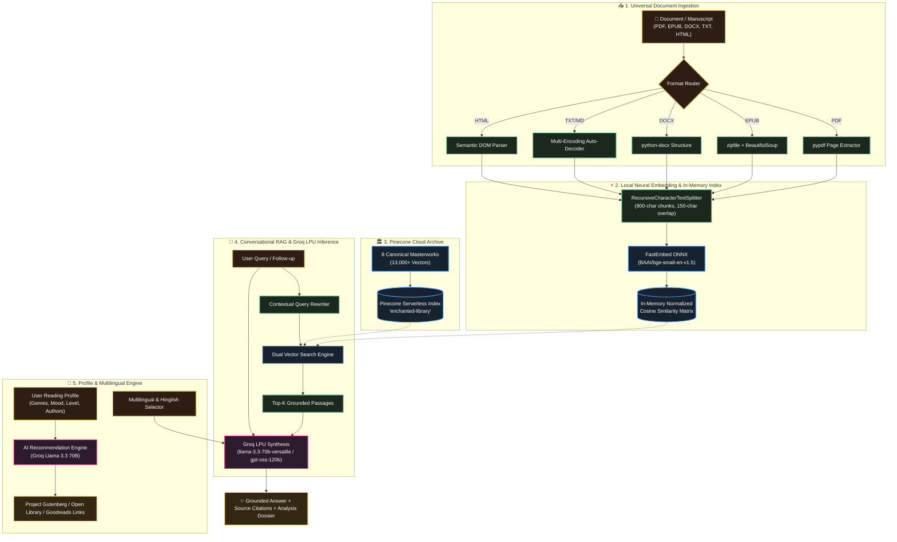

<div align="center">

<!-- 3D Holographic Animated Header Banner -->
<p align="center">
  
</p>

### 🌌 *Step into an Ancient Sanctuary of Knowledge Powered by Next-Gen Neural AI*

<p align="center">
  <a href="https://bookaichatbot-e.streamlit.app/"></a>
  <a href="https://bookaichatbot-x.streamlit.app/"></a>
  <a href="https://streamlit.io"></a>
  <a href="https://python.org"></a>
  <a href="https://groq.com"></a>
  <a href="https://pinecone.io"></a>
  <a href="https://qdrant.github.io/fastembed/"></a>
  <a href="LICENSE"></a>
</p>

<p align="center">
  <a href="https://bookaichatbot-x.streamlit.app/"><b>🌟 Open Live App</b></a> •
  <a href="#-overview">Overview</a> •
  <a href="#-whats-new-in-recent-updates">What's New</a> •
  <a href="#-key-capabilities">Key Features</a> •
  <a href="#-system-architecture">Architecture</a> •
  <a href="#-core-navigation-tabs">Application Tabs</a> •
  <a href="#-supported-manuscript-formats">Formats</a> •
  <a href="#-project-structure">Project Structure</a> •
  <a href="#-quick-start">Quick Start</a> •
  <a href="#-author--connect">Author</a>
</p>


</div>

---

## 📖 Overview

**The Ancient Heritage Library & Book Intelligence** is a production-ready Retrieval-Augmented Generation (RAG) platform and intelligent literary companion. Wrapped in an evocative **Ancient Cultural Heritage & Stone Architecture** aesthetic, it unites classic historical manuscripts and contemporary literature with **Groq LPU high-speed inference**, **FastEmbed ONNX local vector embeddings**, and a **hybrid dual-vector architecture**.

The platform operates across two unified modalities:
1. **Universal Local Document RAG**: Upload any book or document in **PDF, EPUB, DOCX, TXT, Markdown, or HTML**. The text is chunked and embedded in-memory via FastEmbed ONNX (`BAAI/bge-small-en-v1.5`), ensuring instant semantic search and zero third-party cloud data leakage.
2. **Canonical Cloud Archive**: A managed Pinecone Serverless vector database pre-indexed with **13,000+ vector chunks** across 8 world-renowned masterworks.

Users can conduct grounded conversational Q&A with verbatim citations, generate structured executive overviews, build a **personalized reading profile with AI book recommendations**, and switch into **multilingual and Hinglish modes**.

---

## 🚀 What's New in Recent Updates

- 👤 **Personal Reading Profile & AI Book Recommender (`profile.py`)**:
  - Customize reader preferences: favorite genres, current reading mood, reading level, favorite authors, target reading speed, and language.
  - Powered by Groq's **`llama-3.3-70b-versatile`** to curate 6 hyper-personalized book recommendations with rationale and theme breakdowns.
  - Generates direct 1-click links to read or borrow each recommended book on **Project Gutenberg**, **Open Library**, and **Goodreads**.
  - Persistent JSON profile storage with instant downloadable Markdown reports.
- 🌐 **Multilingual & Hinglish Intelligence (`multilingual.py`)**:
  - Full support for English, Hindi (हिंदी), Spanish, French, German, Chinese, Arabic, Portuguese, Russian, Japanese, and conversational **Hinglish** (natural Hindi-English blend).
  - Integrated in-app **LibreTranslate quick translator** and automatic language detection.
- ⚡ **Groq LPU Fleet Upgrade**:
  - Replaced decommissioned models with the ultra-fast, high-reasoning **`llama-3.3-70b-versatile`** as default across profile recommendations and chat synthesis.
  - Active model support including `openai/gpt-oss-120b`, `openai/gpt-oss-20b`, `qwen/qwen3.8-27b`, `groq/compound`, and `whisper-large-v3`.
  - Session-state model synchronization across all sub-modules.
- 🏰 **Streamlined Ancient Heritage Navigation**:
  - Refactored into 4 focused tabs: **📖 Upload & Analyze**, **🏛️ Classic Archive**, **👤 Profile & Multilingual**, and **🏰 Guide**.
- 🛠️ **Modular Extensibility Suite**:
  - Background analytics logger (`analytics.py`), OCR for scanned manuscripts (`ocr.py`), offline Ollama LLM mode (`offline.py`), voice interaction (`voice.py`), and external enrichment from Wikipedia & Open Library (`knowledge.py`).

---

## 🌟 Key Capabilities

<table>
  <tr>
    <td width="50%" valign="top">
      <div align="center">
        <h3>📤 Universal Multi-Format Upload</h3>
      </div>
      <ul>
        <li><b>PDF, EPUB, DOCX, TXT, MD, HTML</b> — Native client-side extraction with multi-encoding fallbacks.</li>
        <li><b>Reading Metrics Engine</b>: Instant calculation of total word count, section/page count, and estimated reading time.</li>
        <li><b>Local ONNX Embeddings</b>: In-memory vectorization via <code>BAAI/bge-small-en-v1.5</code> (384 dimensions) with zero cloud data leakage.</li>
      </ul>
    </td>
    <td width="50%" valign="top">
      <div align="center">
        <h3>📑 Automated Deep Book Analysis</h3>
      </div>
      <ul>
        <li><b>Executive Synopsis</b>: Core premise, central conflicts, and thematic resolution.</li>
        <li><b>Key Figures & Dynamics</b>: Motivations, character relationships, and arcs.</li>
        <li><b>Structural Narrative Map</b>: Critical turning points, thematic tapestry, and timeless takeaways.</li>
        <li><b>1-Click Export</b>: Download comprehensive analysis dossiers in clean Markdown.</li>
      </ul>
    </td>
  </tr>
  <tr>
    <td width="50%" valign="top">
      <div align="center">
        <h3>💬 Grounded Q&A with Transparent Citations</h3>
      </div>
      <ul>
        <li><b>Contextual Query Rewriter</b>: Resolves follow-up pronouns (he, she, it, they) in multi-turn dialogues.</li>
        <li><b>Transparent Citations</b>: Expandable citation cards showing verbatim passages, page numbers, and cosine similarity scores.</li>
        <li><b>Starter Question Pills</b>: Pre-curated prompts for immediate literary discovery.</li>
      </ul>
    </td>
    <td width="50%" valign="top">
      <div align="center">
        <h3>🏛️ Pre-Indexed Classics Cloud Archive</h3>
      </div>
      <ul>
        <li><b>13,000+ Pre-Indexed Vectors</b> across 8 masterworks stored in Pinecone Serverless on AWS.</li>
        <li><b>Dual-Mode Architecture</b>: Seamlessly switch between custom uploaded manuscripts and canonical classics.</li>
        <li><b>Sub-Second Retrieval</b>: Serverless index with cached retrievers for ultra-responsive answers.</li>
      </ul>
    </td>
  </tr>
  <tr>
    <td width="50%" valign="top">
      <div align="center">
        <h3>👤 Smart Reading Profile & Recommendations</h3>
      </div>
      <ul>
        <li><b>Reader Preference Profiling</b>: 16+ genres, 8 reading moods, experience levels, and favorite authors.</li>
        <li><b>AI Curation via Llama 3.3 70B</b>: 6 tailored recommendations with custom rationale and core hooks.</li>
        <li><b>Direct Book Links</b>: Instant links to Project Gutenberg (free full text), Open Library, and Goodreads.</li>
        <li><b>Persistent Storage</b>: Profile saved locally in JSON with markdown dossier download.</li>
      </ul>
    </td>
    <td width="50%" valign="top">
      <div align="center">
        <h3>🌍 Multilingual & Hinglish Intelligence</h3>
      </div>
      <ul>
        <li><b>Global Language Support</b>: English, Hindi, Spanish, French, German, and 5+ more.</li>
        <li><b>Conversational Hinglish Mode</b>: Natural Romanized Hindi-English explanations for Indian literary readers.</li>
        <li><b>Quick In-App Translator</b>: Free translation and language detection powered by LibreTranslate.</li>
      </ul>
    </td>
  </tr>
</table>

---

## 🌌 System Architecture



---

## 🖥️ Core Navigation Tabs

The user interface in [`app.py`](book-ai-chatbot-main/app.py) is organized into seven architectural chambers:

| Tab | Icon | Description | Key Modules |
| :--- | :---: | :--- | :--- |
| **Upload & Analyze** | 📖 | Inscribe new manuscripts in any format. Instant metrics, automated 5-part executive overview, OCR manuscript scanning, ask-by-page filtering, smart summarizer, voice audio, external knowledge enrichment, and grounded conversational Q&A. | `app.py`, `ocr.py`, `ask_by_page.py`, `summarizer.py`, `knowledge.py`, `voice.py` |
| **Classic Archive** | 🏛️ | Browse and query pre-indexed world classics (over 13,000 vectors). Zero upload required. Filter by title or ask questions across the entire collection. | `app.py`, `langchain-pinecone` |
| **Reading Profile** | 👤 | Build your personal reader profile (genres, mood, reading level, favorite authors). Receive 6 AI-curated book recommendations with free read/borrow links, manage persistent JSON profiles, and adjust language / Hinglish modes. | `profile.py`, `multilingual.py` |
| **Community Library** | 📚 | Upload community manuscripts for administrative review and browse/download approved community books across multiple genres. | `community_books.py` |
| **Offline Local AI** | 💻 | Run private local AI queries via Ollama without any cloud API key or internet access required. | `offline.py` |
| **Admin & Analytics** | 🔐 | Unified control chamber with community submissions review, interaction telemetry dashboard with feedback ratings, and API key manager. | `community_books.py`, `analytics.py`, `api_keys.py` |
| **Guide & Architecture** | 🏰 | Comprehensive interactive guide detailing data ingestion pipelines, vector mathematics, similarity thresholds, and model parameters. | `app.py` |

---

## 📚 Supported Manuscript Formats

<div align="center">

| Format | Extension | Extraction Engine | Capabilities |
| :--- | :---: | :---: | :--- |
| **Portable Document** | `.pdf` | `pypdf.PdfReader` | Page-by-page text parsing with exact page metadata |
| **Electronic Publication** | `.epub` | `zipfile` + `BeautifulSoup` | Chapter-order XML/XHTML extraction |
| **Microsoft Word** | `.docx`, `.doc` | `python-docx` | Paragraph & table content extraction |
| **Plain Text & Markdown** | `.txt`, `.md`, `.rst` | Multi-Encoding Decoder | UTF-8, UTF-8-SIG, Latin-1, CP1252 auto-detection |
| **Web Hypertext** | `.html`, `.htm` | `BeautifulSoup` | Clean semantic DOM parsing with script/style stripping |

</div>

---

## 🏛️ Pre-Indexed Canonical Classics

The Pinecone Cloud archive includes full vector indexing for:

<div align="center">

| # | Masterwork | Author | Genre / Period |
| :-: | :--- | :--- | :--- |
| 1 | **Pride and Prejudice** | Jane Austen | Romantic Classic (1813) |
| 2 | **Frankenstein** | Mary Shelley | Gothic Science Fiction (1818) |
| 3 | **Little Women** | Louisa May Alcott | Coming-of-Age Fiction (1868) |
| 4 | **Crime and Punishment** | Fyodor Dostoevsky | Psychological Realism (1866) |
| 5 | **The Mahabharata** | Krishna-Dwaipayana Vyasa | Ancient Epic & Philosophy |
| 6 | **Bhagavad Gita** | Vyasa | Spiritual & Philosophical Classic |
| 7 | **Sense and Sensibility** | Jane Austen | Classic Literary Fiction (1811) |
| 8 | **The Yoga-Vasishtha Maharamayana** | Valmiki | Ancient Vedantic Discourse |

</div>

---

## 📂 Project Structure

```bash
Book_AI_Chatbot/
├── .devcontainer/               # Containerized dev configuration
├── README.md                    # Root project documentation (you are here)
└── book-ai-chatbot-main/         # Primary application directory
    ├── app.py                   # Main Streamlit application with Ancient Heritage UI & RAG
    ├── profile.py               # Personalized reading profile & AI book recommender
    ├── multilingual.py          # Multilingual, Hinglish mode & LibreTranslate integration
    ├── analytics.py             # Interaction logger with SQLite & rating metrics
    ├── api_keys.py              # Secure in-app API key manager
    ├── ask_by_page.py           # Page-level specific interrogation utility
    ├── ingest.py                # Batch indexing script for Pinecone Vector Store
    ├── ingestion.ipynb          # Jupyter exploration notebook for embeddings & ingestion
    ├── knowledge.py             # External knowledge lookup (Wikipedia, Open Library)
    ├── ocr.py                   # Tesseract OCR & image-to-text pipeline
    ├── offline.py               # Local / offline LLM runner via Ollama
    ├── summarizer.py            # Chapter summarizer with sentence highlight mode
    ├── voice.py                 # Browser Speech-to-Text & Text-to-Speech audio support
    ├── style.py                 # Ancient Heritage CSS styling tokens and helpers
    ├── test_verification.py     # Automated verification test suite
    ├── run.ps1                  # Windows PowerShell 1-click launcher
    ├── streamlit_app.py         # Streamlit Cloud deployment entrypoint
    ├── requirements.txt         # Production Python dependencies
    ├── .env.example             # Template for API keys
    └── .env                     # Local API keys (git-ignored)
```

---

## 🛠️ Tech Stack & Dependencies

<p align="center">
  
</p>

- **Frontend & Visuals**: Streamlit (Ancient Heritage Stone & Gold Aesthetic) • [Live App on Streamlit Cloud](https://bookaichatbot-x.streamlit.app/)
- **LLM Synthesis**: Groq LPU (`llama-3.3-70b-versatile`, `openai/gpt-oss-120b`, `openai/gpt-oss-20b`, `qwen/qwen3.8-27b`)
- **Embeddings**: `fastembed` ONNX Runtime (`BAAI/bge-small-en-v1.5`, 384 dimensions)
- **Vector Stores**: In-Memory Normalized Numpy Cosine Matrix & Pinecone Serverless (AWS)
- **Orchestration**: LangChain Core, LangChain Community, `langchain-groq`, `langchain-pinecone`
- **Document Parsers**: `pypdf`, `python-docx`, `beautifulsoup4`, `zipfile`, `pytesseract`, `Pillow`
- **Translation & Data**: `requests`, `pandas`, `altair`, LibreTranslate free API

---

## 🚀 Quick Start

### 1. Clone the Repository
```bash
git clone https://github.com/Aniketyadav29/Book_AI_Chatbot.git
cd Book_AI_Chatbot/book-ai-chatbot-main
```

### 2. Set Up Virtual Environment & Install Dependencies
```bash
# Create virtual environment
python -m venv venv

# Activate virtual environment
# On Windows (PowerShell):
.\venv\Scripts\Activate.ps1
# On macOS/Linux:
source venv/bin/activate

# Install requirements
pip install -r requirements.txt
```

### 3. Configure API Credentials
Create a `.env` file in `book-ai-chatbot-main` (or copy from `.env.example`):
```env
# Free Groq API key: https://console.groq.com
GROQ_API_KEY=gsk_your_groq_api_key_here

# Free Pinecone API key: https://app.pinecone.io
PINECONE_API_KEY=pcsk_your_pinecone_api_key_here
```

### 4. Launch the Application

#### Option A: Windows One-Click Launcher
```powershell
.\run.ps1
```
*`run.ps1` automatically verifies API keys in `.env`, configures the ONNX runtime memory allocator (`ORT_DISABLE_ARENA_BASED_ALLOCATOR=1`), and starts the server.*

#### Option B: Standard Streamlit Run
```bash
python -m streamlit run app.py
```

Open **`http://localhost:8501`** in your browser.

> [!TIP]
> **Windows ONNX Memory Fix**: If you encounter memory allocator warnings with `fastembed` ONNX on Windows, set the environment variable prior to launching:
> ```powershell
> $env:ORT_DISABLE_ARENA_BASED_ALLOCATOR = "1"
> ```

---

## 🧪 Automated Verification Suite

Validate end-to-end document extraction, local vector similarity, Groq LLM synthesis, and Pinecone connectivity by executing:

```bash
python test_verification.py
```

<details>
<summary><b>🔍 View Test Suite Output Preview</b></summary>

```text
============================================================
TEST 1: Multi-Format Document Extraction
============================================================
[OK] TXT Extraction passed! Characters: 205
[OK] HTML Extraction passed! Characters: 95
[OK] DOCX Extraction passed! Characters: 100
[OK] EPUB Extraction passed! Characters: 81
[OK] PDF Handler verified!

============================================================
TEST 2: In-Memory FastEmbed Vector Indexing & Search
============================================================
Query: 'Who translated the ancient glyphs?'
Top Match (Score: 0.767): Dr. Aris Thorne translated the ancient glyphs...
[OK] In-memory vector search passed!

============================================================
TEST 3: Groq LLM Book Overview & Grounded Q&A
============================================================
[OK] Book Overview generated successfully!
[OK] Grounded Q&A verified successfully!

============================================================
TEST 4: Pinecone Classic Library Archive Retriever
============================================================
Retrieved 3 docs from Pinecone 'enchanted-library'
[OK] Pinecone classic library retriever verified!

============================================================
[SUCCESS] ALL 4 TEST SUITES PASSED PERFECTLY!
============================================================
```
</details>

---

## ☁️ Streamlit Cloud Deployment

This application is deployed and accessible at:
👉 **[bookaichatbot-x.streamlit.app](https://bookaichatbot-x.streamlit.app/)**

### Deploying Your Own Instance:
1. Fork or push this repository to GitHub.
2. Log into [share.streamlit.io](https://share.streamlit.io/).
3. Connect your repository:
   - **Repository**: `YourUsername/Book_AI_Chatbot`
   - **Main file path**: `book-ai-chatbot-main/streamlit_app.py` (or `book-ai-chatbot-main/app.py`)
4. In the Streamlit Cloud dashboard, navigate to **Settings** → **Secrets** and add:
   ```toml
   GROQ_API_KEY = "gsk_..."
   PINECONE_API_KEY = "pcsk_..."
   ```
5. Click **Deploy!**

---

## 👤 Author & Connect

<div align="center">

### **Aniket Yadav**
*AI & Full-Stack Developer*

<a href="mailto:anikety7905@gmail.com"></a>
<a href="https://github.com/Aniketyadav29"></a>
<a href="https://bookaichatbot-x.streamlit.app/"></a>

---

<p align="center">
  
</p>

⭐ **Star this repository if you find it helpful!**

</div>
