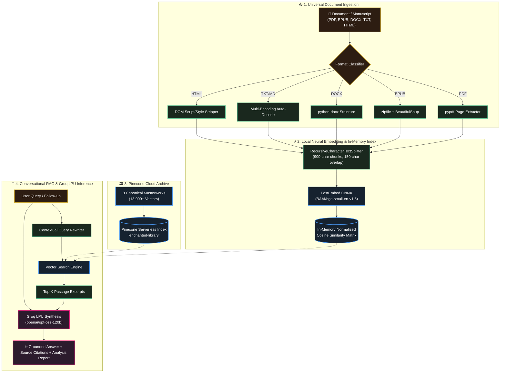

<div align="center">

<!-- 3D Holographic Animated Header Banner -->
<p align="center">
  
</p>

### 🌌 *Step into an Ancient Sanctuary of Knowledge Powered by Next-Gen Neural AI*

<p align="center">
  <a href="https://book-ai-chatbot.streamlit.app"></a>
  <a href="https://streamlit.io"></a>
  <a href="https://python.org"></a>
  <a href="https://groq.com"></a>
  <a href="https://pinecone.io"></a>
  <a href="https://qdrant.github.io/fastembed/"></a>
  <a href="LICENSE"></a>
</p>

<p align="center">
  <a href="https://book-ai-chatbot.streamlit.app"><b>🌟 Open Streamlit App</b></a> •
  <a href="#-overview">Overview</a> •
  <a href="#-key-capabilities">Key Features</a> •
  <a href="#-3d-architecture-pipeline">Architecture</a> •
  <a href="#-supported-manuscript-formats">Formats</a> •
  <a href="#-quick-start">Quick Start</a> •
  <a href="#-author--connect">Author</a>
</p>


</div>

---

## 📖 Overview

**The Ancient Heritage Library & Book Intelligence** is an enterprise-grade Retrieval-Augmented Generation (RAG) ecosystem. It unites timeless historical manuscripts and contemporary literature with cutting-edge **Groq LPU Inference**, **FastEmbed ONNX Embeddings**, and an **in-memory normalized vector search engine**.

Upload any document in **any format (PDF, EPUB, DOCX, TXT, Markdown, HTML)** to instantly unlock:
- 📑 **Comprehensive Literary Overviews** (Executive synopsis, core themes, key figures, narrative arc, takeaways).
- 💬 **Grounded Conversational Q&A** with verbatim citations, page tracking, and zero hallucination risk.
- 🏛️ **Timeless Classics Archive** pre-indexed across 13,000+ vector chunks in Pinecone Serverless.

---

## 🌟 Key Capabilities

<table>
  <tr>
    <td width="50%" valign="top">
      <div align="center">
        <h3>📤 Universal Multi-Format Upload</h3>
      </div>
      <ul>
        <li><b>PDF, EPUB, DOCX, TXT, MD, HTML</b> — Native client-side parsing without requiring third-party cloud uploads.</li>
        <li><b>Reading Metrics Engine</b>: Instant calculation of total word count, section/page count, and estimated reading time.</li>
        <li><b>Fast ONNX Embeddings</b>: Local vector generation using <code>BAAI/bge-small-en-v1.5</code>.</li>
      </ul>
    </td>
    <td width="50%" valign="top">
      <div align="center">
        <h3>📑 Automated Deep Book Analysis</h3>
      </div>
      <ul>
        <li><b>Executive Synopsis</b>: Core premise, central conflict, and thematic resolution.</li>
        <li><b>Key Figures & Dynamics</b>: Motivations, character arcs, and roles.</li>
        <li><b>Structural Narrative Map</b>: Critical turning points & literary takeaways.</li>
        <li><b>1-Click Export</b>: Download full analysis reports in clean Markdown.</li>
      </ul>
    </td>
  </tr>
  <tr>
    <td width="50%" valign="top">
      <div align="center">
        <h3>💬 Grounded Q&A with Citations</h3>
      </div>
      <ul>
        <li><b>Conversational Query Rewriter</b>: Resolves follow-up pronouns (he, she, it) in multi-turn dialogues.</li>
        <li><b>Transparent Citations</b>: Expandable cards displaying exact manuscript passages and relevance scores.</li>
        <li><b>Starter Question Pills</b>: 1-click prompts for immediate narrative insights.</li>
      </ul>
    </td>
    <td width="50%" valign="top">
      <div align="center">
        <h3>🏛️ Pre-Indexed Classics Cloud Archive</h3>
      </div>
      <ul>
        <li><b>13,000+ Pre-Indexed Vectors</b> across 8 timeless masterworks in Pinecone.</li>
        <li><b>Dual-Mode Architecture</b>: Seamlessly switch between custom uploaded books and canonical classics.</li>
        <li><b>Sub-Second Retrieval</b>: Powered by Pinecone Serverless on AWS.</li>
      </ul>
    </td>
  </tr>
</table>

---

## 🌌 3D Architecture Pipeline



---

## 📚 Supported Manuscript Formats

<div align="center">

| Format | Extension | Extraction Engine | Capabilities |
| :--- | :---: | :---: | :--- |
| **Portable Document** | `.pdf` | `pypdf.PdfReader` | Page-by-page text parsing with exact page metadata |
| **Electronic Publication** | `.epub` | `zipfile` + `BeautifulSoup` | Chapter-order XML/XHTML extraction |
| **Microsoft Word** | `.docx`, `.doc` | `python-docx` | Paragraph & table content extraction |
| **Plain Text & Markdown** | `.txt`, `.md`, `.rst` | Multi-Encoding Decoder | UTF-8, UTF-8-SIG, Latin-1, CP1252 auto-detection |
| **Web Hypertext** | `.html`, `.htm` | `BeautifulSoup` | Clean semantic DOM parsing |

</div>

---

## 🏛️ Pre-Indexed Canonical Classics

The Pinecone Cloud archive includes full vector indexing for:

<div align="center">

| # | Masterwork | Author | Genre / Period |
| :-: | :--- | :--- | :--- |
| 1 | **Pride and Prejudice** | Jane Austen | Romantic Classic (1813) |
| 2 | **Frankenstein** | Mary Shelley | Gothic Science Fiction (1818) |
| 3 | **Little Women** | Louisa May Alcott | Coming-of-Age Fiction (1868) |
| 4 | **Crime and Punishment** | Fyodor Dostoevsky | Psychological Realism (1866) |
| 5 | **The Mahabharata** | Krishna-Dwaipayana Vyasa | Ancient Epic & Philosophy |
| 6 | **Bhagavad Gita** | Vyasa | Spiritual & Philosophical Classic |
| 7 | **Sense and Sensibility** | Jane Austen | Classic Literary Fiction (1811) |
| 8 | **The Yoga-Vasishtha Maharamayana** | Valmiki | Ancient Vedantic Discourse |

</div>

---

## 🛠️ Tech Stack & Dependencies

<p align="center">
  
</p>

- **Frontend & Visuals**: Streamlit (Ancient Heritage Stone & Gold Aesthetic) • [Live App on Streamlit Cloud](https://book-ai-chatbot.streamlit.app)
- **LLM Synthesis**: Groq LPU (`openai/gpt-oss-120b`, `openai/gpt-oss-20b`, `qwen/qwen3.8-27b`)
- **Embeddings**: `fastembed` ONNX Runtime (`BAAI/bge-small-en-v1.5`, 384 dimensions)
- **Vector Stores**: In-Memory Normalized Numpy Cosine Matrix & Pinecone Serverless
- **Orchestration**: LangChain Core & Community
- **Document Parsers**: `pypdf`, `python-docx`, `beautifulsoup4`, `zipfile`

---

## 🚀 Quick Start

### 1. Clone the Repository
```bash
git clone https://github.com/Aniketyadav29/Book_AI_Chatbot.git
cd Book_AI_Chatbot/book-ai-chatbot-main
```

### 2. Install Dependencies
```bash
pip install -r requirements.txt
```

### 3. Configure API Credentials
Create a `.env` file in `book-ai-chatbot-main`:
```env
# Free Groq API key: https://console.groq.com
GROQ_API_KEY=gsk_your_groq_api_key_here

# Free Pinecone API key: https://app.pinecone.io
PINECONE_API_KEY=pcsk_your_pinecone_api_key_here
```

### 4. Launch the App
```bash
# Windows One-Click Launcher:
.\run.ps1

# Or with Streamlit directly:
python -m streamlit run app.py
```
Open **`http://localhost:8501`** in your browser.

---

## 🧪 Automated Verification Suite

Run full end-to-end tests across document extractors, in-memory vector similarity, Groq LLM synthesis, and Pinecone:

```bash
python test_verification.py
```

<details>
<summary><b>🔍 View Test Suite Output Preview</b></summary>

```text
============================================================
TEST 1: Multi-Format Document Extraction
============================================================
[OK] TXT Extraction passed! Characters: 205
[OK] HTML Extraction passed! Characters: 95
[OK] DOCX Extraction passed! Characters: 100
[OK] EPUB Extraction passed! Characters: 81
[OK] PDF Handler verified!

============================================================
TEST 2: In-Memory FastEmbed Vector Indexing & Search
============================================================
Query: 'Who translated the ancient glyphs?'
Top Match (Score: 0.767): Dr. Aris Thorne translated the ancient glyphs...
[OK] In-memory vector search passed!

============================================================
TEST 3: Groq LLM Book Overview & Grounded Q&A
============================================================
[OK] Book Overview generated successfully!
[OK] Grounded Q&A verified successfully!

============================================================
TEST 4: Pinecone Classic Library Archive Retriever
============================================================
Retrieved 3 docs from Pinecone 'enchanted-library'
[OK] Pinecone classic library retriever verified!

============================================================
[SUCCESS] ALL 4 TEST SUITES PASSED PERFECTLY!
============================================================
```
</details>

---

## 👤 Author & Connect

<div align="center">

### **Aniket Yadav**
*AI & Full-Stack Developer*

<a href="mailto:anikety7905@gmail.com"></a>
<a href="https://github.com/Aniketyadav29"></a>
<a href="https://book-ai-chatbot.streamlit.app"></a>

---

<p align="center">
  
</p>

⭐ **Star this repository if you find it helpful!**

</div>
