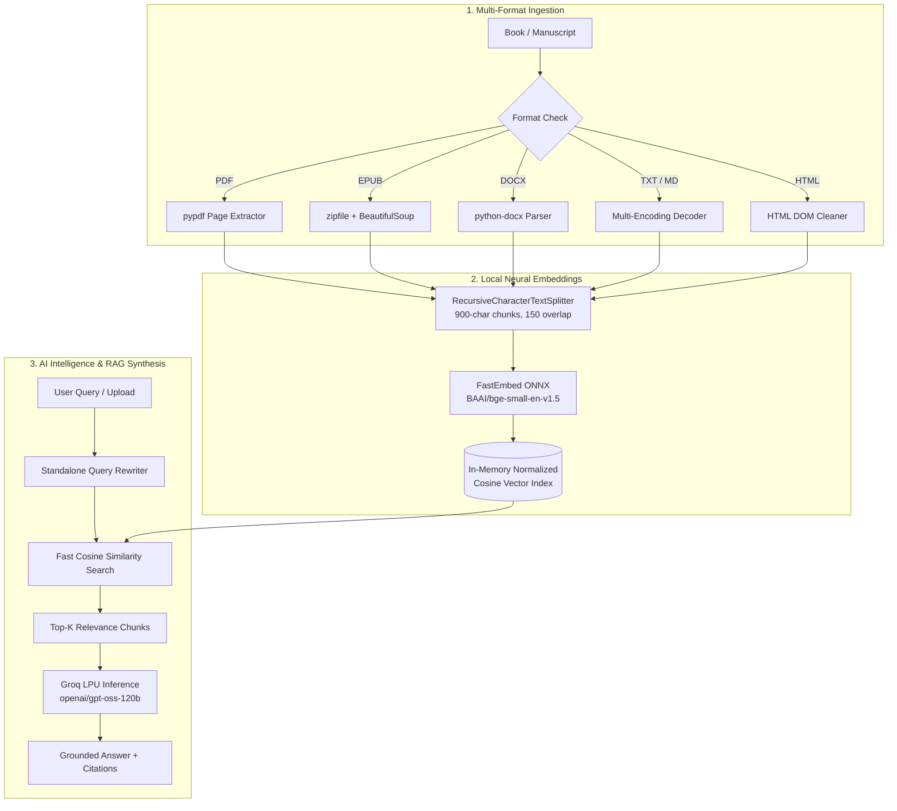

<div align="center">

# 🏛️ The Ancient Heritage Library & Book Intelligence 🏛️
### *Universal Multi-Format Book Ingestion • Neural Vector RAG • Automated Literary Overviews • Grounded AI Conversations*

[](https://book-ai-chatbot.onrender.com/)
[](https://www.python.org/)
[](https://python.langchain.com/)
[](https://groq.com/)
[](https://www.pinecone.io/)
[](https://qdrant.github.io/fastembed/)
[](https://opensource.org/licenses/MIT)

**[🔗 Live Application (Render Deployment)](https://book-ai-chatbot.onrender.com/)** • **[📖 Repository](https://github.com/Aniketyadav29/Book_AI_Chatbot.git)**

---

</div>

## 📖 Overview

**The Ancient Heritage Library & Book Intelligence** is an advanced Retrieval-Augmented Generation (RAG) system built with **Streamlit**, **LangChain**, **Groq LPU Inference**, and **FastEmbed**.

It bridges timeless classic literature with contemporary neural search. Upload any book or manuscript in **any format (PDF, EPUB, DOCX, TXT, Markdown, HTML)** to instantly receive a structured deep literary overview, character breakdowns, structural analysis, and interactive grounded Q&A with verbatim citations — or explore the pre-indexed cloud archive containing 13,000+ vector chunks across 8 timeless canonical masterworks.

---

## 🌟 Key Features

### 1. 📤 Universal Multi-Format Book Upload
- **Any Document Format**: Seamlessly extracts text from:
  - 📕 **PDF** (`.pdf`) — Page-by-page extraction via `pypdf`.
  - 📗 **EPUB** (`.epub`) — Chapter-by-chapter XML/HTML extraction via `BeautifulSoup` & `zipfile`.
  - 📘 **Word DOCX** (`.docx`, `.doc`) — Document paragraph and table structure via `python-docx`.
  - 📄 **Plain Text & Markdown** (`.txt`, `.md`, `.rst`) — Multi-encoding auto-fallback (UTF-8, Latin-1, CP1252).
  - 🌐 **Web HTML** (`.html`, `.htm`) — DOM parsing and script/style stripping.
- **Reading Intelligence Metrics**: Real-time calculation of total word count, section/page count, and estimated reading time.
- **Client-Side Privacy**: Custom uploaded manuscripts are embedded and stored in-memory, avoiding unsolicited third-party cloud uploads.

### 2. 📑 Automated Deep Book Overview & Intelligence
Upon uploading any book, the AI automatically analyzes the narrative to produce:
- 📖 **Executive Synopsis**: A 2-3 paragraph synthesis of the book's core premise, conflict, and arc.
- 🎭 **Key Figures & Entities**: Main protagonists, antagonists, character dynamics, and motivations.
- 💡 **Core Themes & Cultural Motifs**: Philosophical and thematic insights.
- 🗺️ **Narrative Arc & Structure**: Structural progression from opening to climax and resolution.
- ⭐ **Key Takeaways & Highlights**: Memorable quotes and lessons.
- 📥 **1-Click Markdown Export**: Download the comprehensive analysis report as a formatted `.md` file.

### 3. 💬 Grounded Q&A Chatbot with Source Citations
- **Contextual Query Reformulation**: Resolves multi-turn conversational pronouns into standalone queries.
- **Exact Passage Citations**: Expandable citation cards showing verbatim text excerpts, section/page numbers, and semantic similarity scores.
- **Quick Starter Pills**: 1-click suggested prompts for immediate inquiries.
- **Zero Hallucination Guardrails**: Answers strictly grounded in retrieved book excerpts.

### 4. 🏛️ Pre-Indexed Classic Tomes Cloud Archive
Search across 13,000+ pre-indexed vector embeddings in Pinecone:
1. *Pride and Prejudice* (Jane Austen)
2. *Frankenstein* (Mary Shelley)
3. *Little Women* (Louisa May Alcott)
4. *Crime and Punishment* (Fyodor Dostoevsky)
5. *The Mahabharata* (Vyasa)
6. *Bhagavad Gita*
7. *Sense and Sensibility* (Jane Austen)
8. *The Yoga-Vasishtha Maharamayana* (Valmiki)

---

## 🏛️ System Architecture



---

## 🛠️ Tech Stack

| Purpose | Technology |
|---|---|
| **Frontend UI** | Streamlit (Ancient Cultural Heritage Theme) |
| **LLM Inference** | Groq LPU (`openai/gpt-oss-120b`, `openai/gpt-oss-20b`, `qwen/qwen3.8-27b`) |
| **Embeddings** | `fastembed` (ONNX Runtime, `BAAI/bge-small-en-v1.5`, 384-dim) |
| **Custom Vector Search** | Normalized Numpy Matrix Cosine-Similarity Engine |
| **Cloud Vector Store** | Pinecone Serverless |
| **Document Parsers** | `pypdf`, `python-docx`, `beautifulsoup4`, `zipfile` |
| **Orchestration** | LangChain Core & Community |
| **Deployment** | Render / Streamlit Cloud |

---

## 🚀 Quick Start Guide

### 1. Prerequisites
- Python 3.10 or higher
- A free Groq API key from [Groq Console](https://console.groq.com)
- *(Optional for Classic Archive)* Pinecone API key from [Pinecone Console](https://app.pinecone.io)

### 2. Installation
```bash
# Clone the repository
git clone https://github.com/Aniketyadav29/Book_AI_Chatbot.git
cd Book_AI_Chatbot/book-ai-chatbot-main

# Install dependencies
pip install -r requirements.txt

# Create .env from .env.example
cp .env.example .env
```

### 3. Environment Variables Configuration
Configure `.env` with your API keys:
```env
GROQ_API_KEY=gsk_your_groq_api_key_here
PINECONE_API_KEY=pcsk_your_pinecone_api_key_here
```

### 4. Run Locally
```bash
# Using PowerShell launcher:
.\run.ps1

# Or with Streamlit directly:
python -m streamlit run app.py
```

Open your browser at `http://localhost:8501`.

---

## 📜 Ingestion Pipeline (For Pre-Indexed Classic Tomes)

To re-ingest or add new books to your Pinecone index:
```bash
python ingest.py
```
This downloads canonical works from Project Gutenberg, chunks them with `RecursiveCharacterTextSplitter`, creates vector embeddings with FastEmbed, and upserts them to Pinecone.

---

## 🧪 Verification & Automated Tests

To run the automated verification suite across all format parsers, vector search, and Groq LLM:
```bash
python test_verification.py
```

---

## 👤 Author & Maintainer

- **Author**: Aniket Yadav
- **Email**: [anikety7905@gmail.com](mailto:anikety7905@gmail.com)
- **GitHub**: [@Aniketyadav29](https://github.com/Aniketyadav29)
- **Project Repository**: [https://github.com/Aniketyadav29/Book_AI_Chatbot.git](https://github.com/Aniketyadav29/Book_AI_Chatbot.git)

---

## 📄 License

This project is licensed under the [MIT License](LICENSE).
